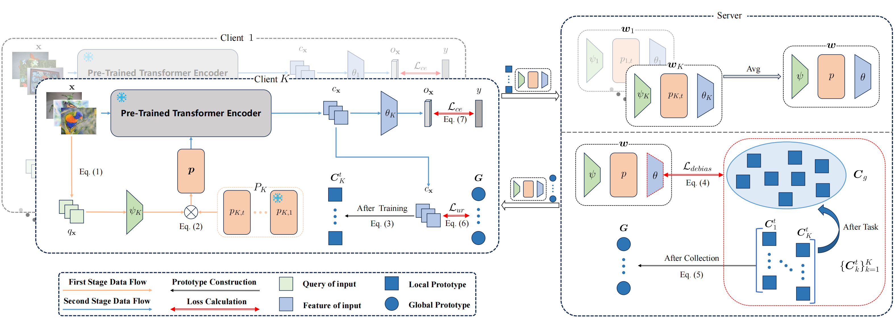

# FPPL: An Efficient and Non-IID Robust Federated Continual Learning Framework

<p align="center">
  
</p>

## 1. Introduction

This repository contains the official source code for the paper FPPL: An Efficient and Non-IID Robust Federated Continual Learning Framework.

## Requirements

To ensure smooth execution of the code, we recommend setting up a dedicated environment using `conda`.

### Steps:

1. First, make sure you have [Anaconda](https://www.anaconda.com/products/distribution) or [Miniconda](https://docs.conda.io/en/latest/miniconda.html) installed.

2. Create a new conda environment:

    ```bash
    conda create -n FPPL python==3.9.18
    ```

3. Activate the environment:

    ```bash
    conda activate FPPL
    ```

4. Install the required packages:

    ```bash
    pip install -r requirements.txt
    ```

## Datasets

CIFAR-100 dataset can be automatically downloaded with `torchvision.datasets`.

ImageNet-R and CUB-200 dataset can be downloaded from the link provided in [LAMDA-PILOT](https://github.com/sun-hailong/LAMDA-PILOT). Please specify the folder of your dataset in `src/utils/conf.py`.

## Experiments

Set the `[DATASET]` and `[MODEL]` options using the filenames of the .json files in the configs folder.

```bash
python src/main_fcl.py --dataset [DATASET] --model [MODEL] --device 0
```

### Examples:

```bash
python src/main_fcl.py --dataset imagenetr_T20_beta5e-1 --model fppl --device 0
```

---

```bash
python src/main_fcl.py --dataset imagenetr_T20_beta5e-1 --model fppl_wo_debias --device 0
```

---

```bash
python src/main_fcl.py --dataset cifar100_T10_NONIID_cprompt_setting --model fppl_cprompt_setting --device 0
```

## Acknowledgments

This repo is heavily based on [LAMDA-PILOT](https://github.com/sun-hailong/LAMDA-PILOT) and [MarsFL](https://github.com/WenkeHuang/MarsFL), many thanks.
